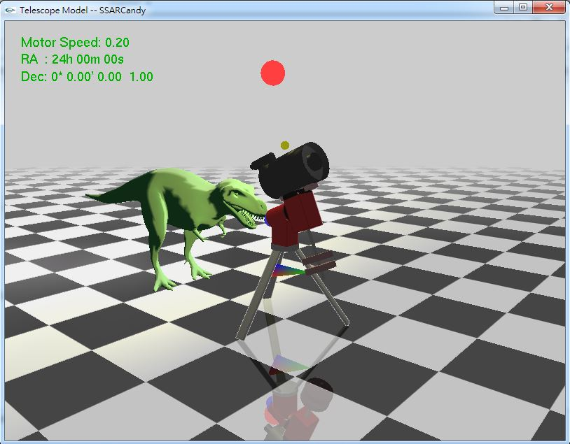
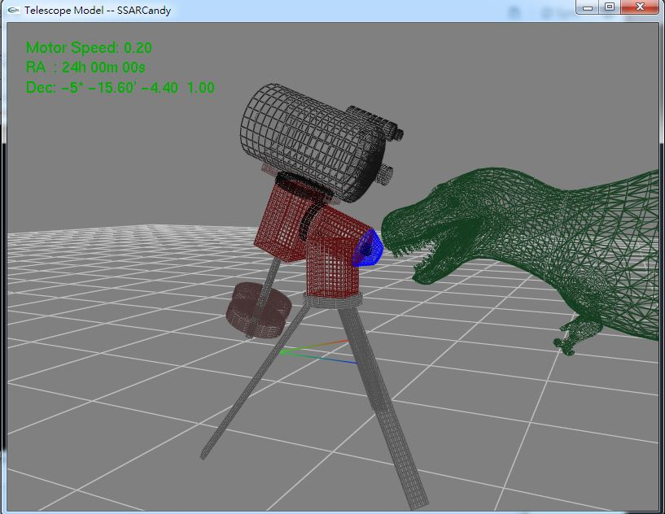
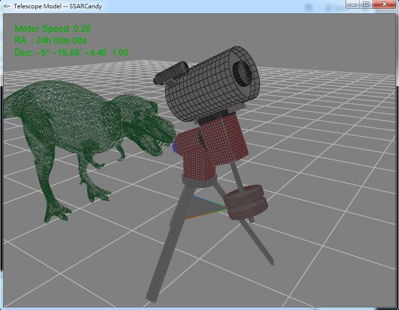

#Telescope Model
###A simple Telescope(with Equatorial) Simulator

---

####操作方式：
- **Control**

	```
	滑鼠   | 拖拉調整視角                
	Z, X   | 調整遠近                    
	A, D   | 調整赤經 (RA)               
	W, S   | 調整赤緯 (Dec)              
	[, ]   | 調整腳架張角                
	+, -   | 調整馬達速度 (Motor Speed)  
	G      | GoTo 自動追蹤太陽           
	P      | Park 歸位至初始位置         
	C      | Crazy 瘋狂亂移動所有可動關節
	方向鍵  | 點光源平移                  
	PgUp   | 點光源向上                  
	PgDown | 點光源向下                  
	```

- Setting

	```
	L      | Shading on/off      (光源)  
	K      | Antialias on/off    (反鋸齒)
	J      | PolygonOffset on/off(實心)  
	H      | Flashlight on/off   (手電筒)
	Esc    | 關閉程式                    
	```

####幾何物體和材質特性：
- 金屬質感的望遠鏡
- 塑膠粗糙恐龍
- 大理石質地板

####截圖




